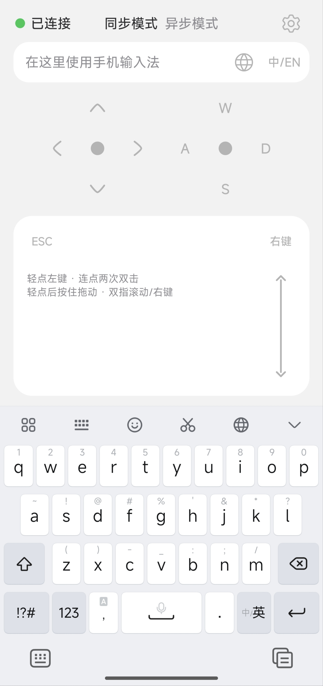

# 局域网无线键盘 / LAN Wireless Keyboard

[中文](README.md) · [English](README.en.md)

Turn an Android phone into a LAN keyboard, touchpad, and game-movement controller for Windows. The phone uses its native IME, while the Windows receiver authenticates the connection with TLS and injects keyboard and pointer events through Win32 `SendInput`.

<p align="center">
  
</p>

## Features

- Chinese phonetic composition stays on the phone; only committed text is sent.
- Synchronous mode sends input immediately; deferred mode keeps a local draft until Send is tapped.
- Includes arrow keys, a W/A/S/D game joystick, Esc, a dedicated right-click button, and an optional scroll strip.
- The touchpad supports movement, tap-to-left-click, double-click on the second lift, one-second long-press dragging, tap-then-hold dragging, two-finger scrolling, and two-finger right-click.
- Globe and `中/EN` buttons switch the PC input method using configurable Windows/macOS shortcut presets.
- Pointer speed, touchpad acceleration, wheel detent spacing, inertia, and haptics are independently adjustable. `1.0×` preserves precise native motion, while faster swipes progressively approach the selected gain.
- Android disconnects immediately when it leaves the foreground. Closing the Windows window keeps it in the notification area; choosing Exit stops it completely.
- Android follows the system light/dark mode by default or can be forced; one copyable dual-theme framework configures page, icon, text, input, and touchpad colors and includes an AI editing prompt.
- The Android interface plus the Windows EXE, window, and notification area use MIT-licensed Hugeicons Stroke Rounded icons.

## Download

Download Android `v1.2.0` and the compatible Windows receiver `v1.1.0` from GitHub **Releases**:

- `LAN-Wireless-Keyboard-Android-v1.2.0.apk`
- `LAN-Wireless-Keyboard-Windows-x64-v1.1.0.zip`

Use `SHA256SUMS.txt` from the same release to verify the downloads. The receiver protocol is unchanged, so this release retains Windows `v1.1.0`; it supports x64 Windows only.

## 1. Install the Windows .NET runtime

The receiver requires the **.NET 10 Desktop Runtime x64**. Do not select the ASP.NET Core Runtime. You do not need the SDK just to run the app.

### Install with WinGet

Open Windows Terminal or PowerShell as an administrator:

```powershell
winget install Microsoft.DotNet.DesktopRuntime.10
```

### Install manually

1. Open the official [.NET 10 download page](https://dotnet.microsoft.com/en-us/download/dotnet/10.0).
2. Find **.NET Desktop Runtime 10**.
3. Under Windows, download the **x64 Installer**.
4. Run the installer and finish setup.

Open a new terminal and verify the installation:

```powershell
dotnet --list-runtimes
```

The output must contain a line beginning with `Microsoft.WindowsDesktop.App 10.`. If it does not, confirm that you installed the Desktop Runtime x64.

## 2. Start the Windows receiver

1. Extract the Windows ZIP into a normal user-writable folder. Do not run the EXE from inside the ZIP or place it in a directory that requires administrator write access.
2. Double-click `VirtualKeyboardReceiver.exe`. Its manifest requests administrator privileges; approve UAC if Windows displays a prompt. The receiver still cannot control the UAC secure desktop.
3. If SmartScreen reports an unknown publisher, verify the filename and SHA-256 first, then choose **More info → Run anyway**. This project does not yet use a commercial code-signing certificate.
4. On the first Windows Firewall prompt, allow **Private networks only**. Do not allow Public networks.
5. Note the LAN IPv4 address, port, and 16-character pairing code shown in the window.

On first launch, the receiver creates a pairing code and TLS certificate in `runtime-data` near the EXE. Do not share, upload, or delete those files. Closing the window minimizes it to the notification area. To stop it completely, right-click the notification icon and choose **Exit**.

## 3. Install the Android client

1. Download the APK to the phone.
2. When Android asks, allow **Install unknown apps** only for the browser or file manager you are currently using.
3. Install the APK, then disable that source's installation permission if desired.
4. Connect the phone and PC to the same trusted LAN. Guest Wi‑Fi must not isolate devices from each other.
5. Open the app, enter Settings, and copy the IPv4 address, port, and pairing code from the Windows window. Save the settings.
6. Return to the main screen and wait for **Connected**. The phone pins the receiver certificate after the first successful connection and rejects later certificate changes.

## 4. Use the app

- Tap the input field and use the phone's native IME. Unselected Chinese phonetic composition is not sent; committed text is.
- Select **Synchronous mode** to send immediately. **Deferred mode** keeps a local draft and sends the complete text only when the Send icon is tapped. Both modes keep the field one line high.
- In synchronous mode, the globe button defaults to `Win + Space`; `中/EN` defaults to `Shift`. Choose another fixed preset in Settings if needed.
- The left control maps to Windows arrow keys. The right W/A/S/D buttons and eight-way joystick control game movement.
- Drag on the touchpad to move the pointer. Tap for left click; a second completed tap emits the standard left-button double-click only when that finger lifts. Hold for one second to hold the left button and receive haptic feedback; tap-then-hold remains available as a fallback drag gesture. Raw touch and ordinary pointer movement do not vibrate. Two-finger slides scroll; a two-finger tap or the top-right button sends right click.
- The independent scroll strip can be disabled in Settings; the top-left touchpad button sends Esc.
- Adjust pointer speed and touchpad acceleration separately in Settings. `1.0×` acceleration is neutral; higher values add more distance to fast swipes while preserving slow precision.
- When the Android activity leaves the foreground, the connection closes and no network worker or queued input remains active.

## Troubleshooting

- **Missing .NET:** reinstall the .NET 10 Desktop Runtime x64 and verify it with `dotnet --list-runtimes`.
- **Cannot connect:** confirm both devices are on the same LAN, the PC address has not changed, the ports match, and Windows Firewall allows the receiver on Private networks.
- **Pairing fails:** enter the complete 16-character code currently displayed by the receiver. Do not use documentation examples.
- **Certificate changed:** first confirm you are connecting to the same PC. Only save the pairing settings again if that receiver's `runtime-data` was intentionally regenerated.
- **Some games do not respond:** applications using Raw Input, anti-cheat drivers, or explicit `SendInput` blocking may ignore simulated input.
- **The UAC screen cannot be controlled:** even an elevated receiver cannot inject into the Windows UAC secure desktop.
- **Notification icon is missing:** expand the hidden notification icons. The icon is black on a light taskbar and white on a dark taskbar.

## Build from source

- Android: use JDK 17 and Android SDK 36, then run `./gradlew testDebugUnitTest lintDebug assembleDebug`.
- Windows: use the .NET 10 SDK, run `dotnet test` inside `windows`, and publish with the project's `win-x64` settings.

Licensed under the [Apache License 2.0](LICENSE). See [THIRD_PARTY_NOTICES.md](THIRD_PARTY_NOTICES.md) for icon attribution.
